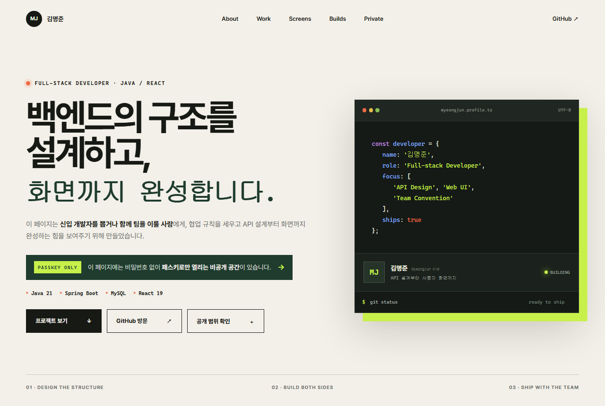
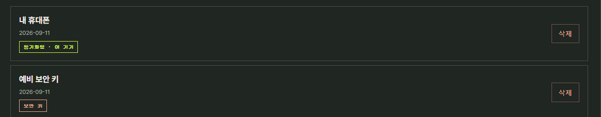

<div align="center">

# T08 · 비밀번호 없이 나만 들어가기

### 소개 페이지는 열어 두고, 나만의 자리는 패스키로 잠급니다

T01에서 만든 개인 포트폴리오 페이지에 **패스키(WebAuthn)** 로 잠긴 비공개 영역을
덧붙인 SKT ALEPH T08 과제입니다. **비밀번호는 어디에도 없습니다.**

### [→ 열어 보기](https://t08-passkey-portfolio.vercel.app)

`판정 47/47` · `테스트 50개 통과` · `비밀번호 입력 칸 0개`

`Java 25` `Spring Boot 4.1.1` `webauthn4j 0.31.8` `Thymeleaf` `JPA` `PostgreSQL`

</div>

> 첫 화면은 **등록 없이 누구나** 열립니다. 심사하는 분은 공개 소개 페이지까지만 보시면
> 되고, 잠긴 자리는 열지 않으셔도 됩니다. 직접 확인해 보고 싶으시면 아래
> [3단계로 확인하기](#3단계로-확인하기)를 따라가면 30초면 됩니다.

> 공개 화면과 문서의 예시는 전부 **합성 데이터**입니다. 실제 연락처나 신분증 번호 같은
> 진짜 개인정보는 저장소와 공개 배포 어디에도 없습니다.

---

## 비밀번호 대신 무엇이 그 자리를 채우나

| | 비밀번호 방식 | 이 저장소의 패스키 방식 |
| --- | --- | --- |
| 서버에 저장되는 것 | 비밀번호 해시 | **공개키** · credential ID · sign counter |
| 유출되면 | 계정이 열림 | 공개키는 열쇠가 아님. **개인키는 기기 밖으로 나가지 않음** |
| 매 로그인 | 같은 값을 반복 전송 | 서버가 **매번 새 질문**을 내고 기기가 서명. 쓴 질문은 버림 |
| 잠금 해제 | 외운 문자열 | **기기의 지문 인증.** 지문 데이터는 서버로 오지 않음 |
| 기기를 잃으면 | 이메일로 복구 | 복구 없음 → 그래서 **패스키 두 개**와 마지막 하나 삭제 금지 |

동작은 세 단계입니다.

1. **등록** — 서버가 일회용 질문을 만들고, 기기가 열쇠 한 쌍을 만들어 **공개키만** 돌려줍니다.
2. **로그인** — 서버가 다시 새 질문을 내고, 기기가 개인키로 서명합니다. 서버는 저장해 둔
   공개키로 그 서명을 확인한 뒤에만 통과시킵니다.
3. **분실 대비** — 패스키를 두 개 등록하고, 하나를 지운 뒤에도 남은 하나로 들어갑니다.

---

## 3단계로 확인하기

| | |
| --- | --- |
| **어디로 가나요** | [공개 소개 첫 화면](https://t08-passkey-portfolio.vercel.app)에서 `나만의 공간` |
| **무엇을 하나요** | ① 이름을 그대로 두고 `패스키 만들기` ② 기기 지문 인증 ③ 비공개 자료 3건 확인 |
| **무엇이 보이면 통과** | 지문 창이 뜨고, 통과 후 비공개 자료 3건과 패스키 이름·등록일·**저장 위치**가 보임 |
| **안 될 때** | 취소하면 안내가 나오고 아무것도 저장되지 않음. 로그인 없이 직접 열면 **401** |

> 첫 요청은 컨테이너가 깨어나느라 몇 초 걸릴 수 있습니다. 스스로 새로고침하는 대기
> 화면이 나왔다가 진짜 페이지로 넘어갑니다. 오류가 아닙니다.

잠그기만 한 것이 아니라, **막힌 요청을 응답으로 남겼습니다.**

```console
$ curl -i https://t08-passkey-portfolio.vercel.app/private
HTTP/1.1 401 Unauthorized
Cache-Control: no-store
Content-Type: application/json;charset=UTF-8

{"error":"passkey_session_required"}
```

```console
$ curl -s https://t08-passkey-portfolio.vercel.app/ | grep -cE '합성 프로젝트|합성 지원 기업|합성 주간 회고'
0
```

화면에서만 감춘 것이 아닙니다. **로그인하지 않은 채 받은 페이지의 소스 어디에도 비공개
내용이 들어 있지 않습니다.**

---

## 공개와 비공개의 경계

첫 화면에서 잠긴 자리가 있다는 사실이 바로 보이고, 공개 내용이 끝나는 자리에서 한 번 더
경계를 긋습니다.



| 영역 | 누가 볼 수 있나 | 내용 |
| --- | --- | --- |
| 공개 소개 페이지 | **누구나.** 등록·로그인 없이 | T01 포트폴리오 내용 그대로 |
| 비공개 자리 | 패스키로 들어온 본인만 | 프로젝트 메모·지원 목록·회고 (합성 데이터) |

---

## 저장 위치를 화면이 말합니다

등록 응답이 주는 `backupEligible`과 `transports`를 그대로 목록에 표시합니다. 어디에
저장됐는지 확인하려고 기기 설정을 열 필요가 없습니다.



- `동기화됨` — 구글 계정·iCloud에 백업되는 자격증명. 기기를 바꿔도 따라옵니다
- `이 기기` / `다른 기기` / `보안 키` — 어디서 만들어졌는지. 두 패스키를 구분할 근거가 됩니다

둘 다 인증기를 설명하는 값이지 키가 아니므로 비밀이 아닙니다.
실물 기기 확인 기록은 [`docs/evidence/12-real-device-registration.md`](docs/evidence/12-real-device-registration.md)에 있습니다.

---

## 제출 자료

| 문서 | 내용 |
| --- | --- |
| [**최종 제출 PDF**](output/pdf/T08-final-submission.pdf) | 판정 47개 전문 · 증거 화면 · 동작 순서 (14쪽) |
| [**발표자료 PPTX**](output/presentation/T08-evidence.pptx) | 같은 내용을 슬라이드로 (15장) |
| [**인증 구현 설명서**](docs/T08-AUTH-GUIDE.md) | ① 무엇으로 ② 왜 ③ 어디를 ④ 확인 기록 ⑤ AI와 나 ⑥ 못 막은 것 |
| [**제출문**](docs/T08-SUBMISSION.md) | 제출 URL · 확인 방법 · AI와 내 판단 · 패스키 저장 위치 |
| [**판정 체크리스트**](docs/T08-ACCEPTANCE-MATRIX.md) | 47개 기준의 상태와 증거 (수정 금지) |
| [**증거 기록**](docs/evidence/) | 통과한 요청과 막힌 요청을 나란히 적은 기록 12건 |

증거 화면의 원본과 그것을 만든 방법은 [`docs/evidence/images/`](docs/evidence/images/)에 있습니다.
공개 화면은 프로덕션에서 읽기만 했고, 잠긴 쪽은 로컬에서 **가상 인증기로 실제 등록·삭제·로그인을
수행하며** 찍었습니다.

## 설계 문서

[**Task**](docs/T08-TASK.md) ·
[**Requirements**](docs/REQUIREMENTS.md) ·
[**Architecture**](docs/T08-ARCHITECTURE.md) ·
[**Implementation Plan**](docs/T08-IMPLEMENTATION-PLAN.md) ·
[**Security & Network**](docs/T08-SECURITY-NETWORK.md) ·
[**Deployment**](docs/T08-DEPLOYMENT.md) ·
[**Decision Log**](docs/DECISIONS.md) ·
[**Status**](docs/STATUS.md)

---

## 네 흐름이 지나는 자리

| 흐름 | 소스 |
| --- | --- |
| 등록 | `WebAuthnController` → `CeremonyService`(질문 발급·보관·소비) → `WebAuthnVerificationAdapter` → `AccountRegistrationService` |
| 로그인 | `WebAuthnController`(username-less) → `AccountAuthenticationService` → 저장된 COSE 공개키로 서명 검증 → 새 세션 |
| 로그아웃 | `SessionController` — 서버 세션 즉시 무효화 |
| 비공개 조회 | `AuthenticationInterceptor`(미인증 401) → `PrivateAreaController` → `PrivateAreaService` — **세션의 account ID만** 사용 |
| 복구 | `PasskeyController` · `PasskeyManagementService` — 두 번째 등록·목록·삭제, 마지막 하나는 409 |

URL이나 요청 본문의 `accountId`는 **소유권 입력으로 쓰지 않습니다.** 남의 것을 적어
보내도 내 자료만 돌아옵니다 ([증거](docs/evidence/08-cross-account-isolation.md)).

## 과제 카드

| 카드 | 내용 | 통과 기준 | |
| --- | --- | --- | --- |
| 1 | 무엇을 잠글지 먼저 가른다 | T08-C13 – C18 | 6/6 |
| 2 | 패스키를 등록한다 | T08-C19 – C26 | 8/8 |
| 3 | 패스키로 들어간다 | T08-C27 – C35 | 9/9 |
| 4 | 기기를 잃어버렸을 때 | T08-C42 – C46 | 5/5 |
| 5 | 확인하고 어떻게 붙였는지 적는다 | T08-C01 – C12, C36 – C41, C47 – C53 | 19/19 |

과제 원문은 [`docs/T08-TASK.md`](docs/T08-TASK.md)에, 원본 카드 이미지는
[`docs/task-source/`](docs/task-source/)에 있습니다.

> **C04–C09는 존재하지 않습니다.** 과제 카드의 번호가 C03에서 C10으로 건너뜁니다.
> 캡처 누락을 의심해 세 출처로 대조한 뒤 닫은 사안입니다
> ([DECISIONS D-003](docs/DECISIONS.md)).

---

## 실행

```bash
./gradlew bootRun
```

http://localhost:8080/ 에서 공개 소개 페이지가 열립니다. 로컬은 H2 인메모리를 쓰고
Flyway가 스키마를 만듭니다.

```bash
./gradlew test
```

> WebAuthn은 origin이 정확히 일치해야 하고 https를 요구합니다. `localhost`만 http
> 예외입니다. 배포 환경에서는 `t08.webauthn.rp-id`·`t08.webauthn.origin`을 반드시
> 덮어써야 합니다.

운영 배포는 `Dockerfile.vercel`과 Supabase PostgreSQL을 사용합니다. 환경변수와 검증
순서는 [`docs/T08-DEPLOYMENT.md`](docs/T08-DEPLOYMENT.md)에 있습니다.

## 저장소 구조

```
src/main/java/dev/myeongjun/passkey/
  web/                           라우트 — 공개·등록·로그인·세션·패스키 관리
  ceremony/                      서버가 만들고 보관하고 한 번만 쓰는 질문
  webauthn/                      webauthn4j 검증 어댑터
  account/ credential/           계정과 공개키
  privatearea/                   비공개 자료 — 세션의 account ID로만 조회
  session/                       인증 인터셉터와 세션
src/main/resources/
  templates/                     index(T01 소개) · access · private · error
  db/migration/                  Flyway 스키마
  application*.properties        WebAuthn RP 설정, 데이터소스, 오류 응답
docs/
  evidence/                      요청·응답 증거 12건 + images/ 화면
  T08-AUTH-GUIDE.md              인증 구현 설명서 여섯 항목
  T08-ACCEPTANCE-MATRIX.md       판정 47개 (수정 금지)
  STATUS.md · DECISIONS.md       현재 상태와 결정 기록
output/                          제출용 PDF·PPTX
scripts/                         증거 캡처와 PDF·PPTX 생성기
```

T01 페이지는 `myeongjundev.github.io` 커밋 `ef6fac2` 기준으로 가져왔습니다. T01이
`04 / ALEPH BUILDS` 절을 추가했을 때 다시 가져와 두 공개 페이지가 갈라지지 않게
했습니다 (→ [DECISIONS D-002](docs/DECISIONS.md)).

## 관련 저장소

- [T01 · 개인 포트폴리오](https://github.com/myeongjundev/myeongjundev.github.io) — 이 과제가 이어붙이는 소개 페이지
- [T07 · 플랜두씨 다이어리](https://github.com/myeongjundev/t07-plando-see-diary) — 비밀번호 기반 인증을 다룬 앞 과제
