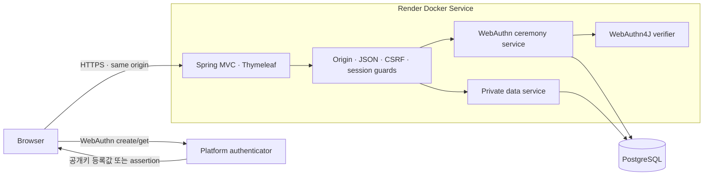

# T08 전체 아키텍처

상태: **구현 중 기준선** · 2026-09-07

이 문서는 T08의 공개·비공개 경계, 패스키 등록과 로그인, 세션, 데이터 모델,
두 번째 패스키, 계정 격리, 증거와 배포를 한 흐름으로 고정한다. 공식 기준 문구는
`T08-ACCEPTANCE-MATRIX.md`가 우선한다. 아직 확보하지 못한 T08-C04~C09는 이 문서로
추정하거나 대체하지 않는다.

## 1. 설계 목표

1. T01 소개 페이지는 가입이나 로그인 없이 계속 열린다.
2. 비공개 내용은 인증 전 HTML·JSON 어디에도 포함되지 않는다.
3. 비밀번호 없이 passkey만으로 계정을 만들고 다시 들어간다.
4. 개인키는 authenticator 밖으로 나오지 않고 서버는 검증된 공개키 기록만 저장한다.
5. 등록·로그인 challenge는 서버가 만들고 한 번만 사용할 수 있다.
6. 로그인 뒤 모든 조회는 세션의 account ID로 범위를 정한다.
7. 한 계정에 패스키를 두 개 등록하고 하나를 안전하게 삭제할 수 있다.
8. 성공과 거절을 같은 형식으로 재현해 제출 증거로 남긴다.

## 2. 선택한 사용자 흐름

### 공개 화면

- `GET /`는 T01 소개 페이지를 그대로 보여 준다.
- 새 항목은 비공개 내용이 아니라 `/access`로 가는 「나만의 공간」 진입 링크뿐이다.
- `GET /access`는 패스키 계정 만들기와 패스키로 들어가기 버튼을 보여 준다.
- WebAuthn을 지원하지 않는 브라우저에는 지원 환경이 필요하다는 안내만 보여 준다.
  비밀번호 대체 수단은 제공하지 않는다.

### 최초 등록이 계정 생성

이메일이나 사용자명으로 빈 계정을 먼저 만들지 않는다. 사용자가 합성 별칭과 패스키
별칭을 입력하고 등록 ceremony를 성공시킨 순간, 계정·첫 패스키·합성 비공개 항목을
한 트랜잭션에서 만든다.

- 계정 식별자: 서버가 생성한 UUID
- WebAuthn user handle: 서버가 생성한 32-byte 난수. 개인정보를 넣지 않는다.
- 화면 별칭: 사용자가 정한 합성 이름. 예: `샘플 계정 A`
- 패스키 별칭: 예: `Windows Hello`, `휴대폰 패스키`

등록을 취소하거나 검증에 실패하면 account와 credential은 한 행도 생성하지 않는다.
남은 challenge 행도 즉시 제거하거나 만료 정리 대상이 된다.

### 사용자명 없는 로그인

등록 옵션에 `residentKey=required`, `userVerification=required`를 사용한다. 인증 옵션은
`allowCredentials`를 비워 discoverable credential을 사용한다. 브라우저가 돌려준
credential ID로 서버가 credential과 account를 찾고, opaque `userHandle`이 그 계정과
일치하는지도 확인한다.

이 방식은 로그인 전에 이메일·별칭을 받을 필요가 없고 credential ID 목록도 공개하지
않는다. 생체 정보나 기기 PIN은 authenticator 안에서 사용자 확인에만 쓰이며 서버로
전송되지 않는다.

### 화면 정보 구조

| 화면 | 공개 여부 | 구성 |
| --- | --- | --- |
| `/` | 공개 | 기존 T01 소개 전체 + 마지막에 잠긴 영역 진입부 |
| `/access` | 공개 | 패스키 로그인, 새 계정 만들기, 지원 환경 안내 |
| `/private` | 보호 | 합성 private item 3개 이상, 계정 별칭, 로그아웃 |
| `/private/passkeys` | 보호 | passkey nickname·등록일 목록, 추가, 삭제 |

공개 첫 화면의 진입부는 「공개 소개는 여기까지」와 「나만의 공간은 패스키로 잠김」을
색·여백·자물쇠 표식으로 구분한다. 실제 private item 제목·본문·개수는 넣지 않는다.
버튼은 `/access`로 이동하며 JavaScript가 꺼져도 private content가 드러나지 않는다.

`/access`의 첫 행동은 「패스키로 들어가기」다. 「새 패스키 계정 만들기」는 보조 행동으로
분리한다. 등록 form에는 합성 별칭과 passkey nickname 두 칸만 있고 password·email·phone
field는 없다. WebAuthn 진행 중에는 중복 버튼을 잠그고, 취소·시간 만료·지원하지 않는
브라우저를 서로 다른 사용자 안내로 보여 주되 서버의 검증 실패 원인은 자세히 노출하지
않는다.

`/private`는 서버가 전달한 현재 account의 item만 렌더링한다. 상단에는 공개 소개로 돌아가기,
passkey 관리, logout을 둔다. 모바일에서도 public/private 제목과 잠금 상태가 텍스트로 남아
색만으로 경계를 표현하지 않는다. 모든 비동기 안내는 `role=status` 또는 `role=alert`를 쓰고,
dialog는 Escape·초점 복귀·키보드 탐색을 지원한다.

## 3. 시스템 경계



신뢰 경계:

| 경계 | 신뢰하지 않는 값 | 서버가 확인하는 값 |
| --- | --- | --- |
| Browser → HTTP | accountId, credential JSON, Origin, CSRF header | 허용 Origin, JSON 형식·크기, CSRF, session |
| Browser → WebAuthn | authenticator 결과 전체 | challenge, origin, RP ID hash, UP/UV, signature |
| Session → data | URL·query의 accountId | session principal의 account ID |
| App → DB | 동시 완료·삭제·재생 요청 | unique/FK/check 제약, 행 잠금, transaction |
| Proxy → app | forwarded host·scheme | WebAuthn expected origin은 환경 설정값과 직접 비교 |

SKT ALeph 보안·네트워크 통제의 상세 기준, 위협 모델과 단계별 gate는
`T08-SECURITY-NETWORK.md`를 따른다. T07의 검증 방식을 계승하되, T08에는 password·JWT·
refresh token이 없으므로 그 구조를 복사하지 않고 passkey challenge·서버 session·RP origin
경계로 치환한다.

## 4. 서버 모듈

```text
src/main/java/dev/myeongjun/passkey/
├─ config/
│  ├─ WebAuthnProperties.java       RP ID · expected origin · timeout
│  ├─ WebAuthnConfiguration.java    WebAuthn4J verifier
│  └─ WebMvcConfiguration.java      interceptor · payload limits
├─ account/
│  ├─ Account.java
│  ├─ AccountRepository.java
│  └─ AccountRegistrationService.java
├─ credential/
│  ├─ PasskeyCredential.java
│  ├─ PasskeyCredentialRepository.java
│  └─ PasskeyManagementService.java
├─ ceremony/
│  ├─ WebAuthnCeremony.java
│  ├─ CeremonyRepository.java
│  ├─ RegistrationService.java
│  ├─ AuthenticationService.java
│  └─ WebAuthnJson.java
├─ session/
│  ├─ SessionPrincipal.java
│  ├─ SessionAuthentication.java
│  ├─ AuthenticationInterceptor.java
│  ├─ CsrfInterceptor.java
│  └─ OriginInterceptor.java
├─ privatearea/
│  ├─ PrivateItem.java
│  ├─ PrivateItemRepository.java
│  ├─ PrivateAreaService.java
│  └─ PrivateAreaController.java
├─ evidence/
│  ├─ SecurityEvent.java
│  └─ SecurityEventService.java
└─ web/
   ├─ HomeController.java
   ├─ AccessController.java
   ├─ WebAuthnController.java
   └─ ApiErrorHandler.java
```

JavaScript는 `src/main/resources/static/passkey.js` 한 곳에서 다음만 담당한다.

- JSON option의 base64url 값을 `ArrayBuffer`로 변환
- `navigator.credentials.create()`와 `navigator.credentials.get()` 호출
- credential을 JSON으로 직렬화해 finish endpoint에 전달
- 사용자 취소(`NotAllowedError`)를 cancel endpoint와 화면 안내로 연결

서명 검증, challenge 판단, 사용자 식별, 소유권 판단은 JavaScript가 하지 않는다.

## 5. 데이터 모델

### `accounts`

| 열 | 규칙 |
| --- | --- |
| `id` | UUID PK, 서버 생성 |
| `user_handle` | 32-byte opaque value, UNIQUE, 개인정보 금지 |
| `display_name` | 합성 별칭, 1~40자 |
| `created_at` | UTC |

### `passkey_credentials`

| 열 | 규칙 |
| --- | --- |
| `id` | UUID PK |
| `account_id` | FK → accounts, NOT NULL |
| `credential_id` | binary, UNIQUE |
| `public_key_cose` | 검증된 COSE 공개키 bytes |
| `credential_record` | WebAuthn4J가 다시 구성할 검증 기록의 JSON |
| `sign_count` | 마지막 성공 assertion의 counter |
| `transports` | 등록 응답의 transports |
| `backup_eligible`, `backup_state` | passkey backup flags |
| `nickname` | 계정 안에서 UNIQUE, 1~40자 |
| `registered_at`, `last_used_at` | UTC |

DB에는 비밀번호, 비밀번호 hash, 개인키 열을 만들지 않는다. `credential_record`에는
공개 검증 자료만 들어가며 원본 attestation/clientData를 무기한 저장하지 않는다.

### `webauthn_ceremonies`

| 열 | 규칙 |
| --- | --- |
| `id` | UUID PK, 브라우저가 finish에 돌려주는 ceremony ID |
| `kind` | `CREATE_ACCOUNT`, `ADD_PASSKEY`, `AUTHENTICATE` |
| `challenge` | `SecureRandom` 32 bytes, UNIQUE |
| `account_id` | 추가 등록에만 사용, 그 외 nullable |
| `pending_user_handle` | 최초 등록용 32-byte 난수 |
| `pending_display_name`, `pending_nickname` | 검증 성공 전 임시 값 |
| `expires_at` | 생성 후 5분 |
| `consumed_at` | 첫 finish 시도에 기록 |
| `created_at` | UTC |

challenge는 응답 검증이 성공했을 때가 아니라 **첫 finish 시도 직전** 별도 transaction에서
소비한다. 따라서 잘못된 서명도 같은 challenge로 다시 시도할 수 없다. 동시 요청은
pessimistic row lock과 `consumed_at IS NULL` 조건으로 하나만 lease를 얻는다.

### `private_items`

| 열 | 규칙 |
| --- | --- |
| `id` | UUID PK |
| `account_id` | FK → accounts, NOT NULL |
| `category` | `PROJECT`, `TARGET`, `RETROSPECTIVE` |
| `title`, `body` | 합성 데이터만 |
| `sort_order` | 계정 안의 표시 순서 |
| `created_at` | UTC |

최초 계정 생성 시 세 항목을 합성 fixture로 만든다. 두 시험 계정은 제목과 내용이 서로
달라야 계정 격리 검사가 의미가 있다.

### `security_events`

성공·거절 종류, account ID(nullable), credential ID의 HMAC fingerprint, ceremony ID,
시각만 저장한다. challenge, credential JSON, session ID, 쿠키, 생체 정보는 저장하지 않는다.

## 6. HTTP 계약

### 공개 HTML

| Method | Path | 결과 |
| --- | --- | --- |
| GET | `/` | T01 공개 소개 페이지 200 |
| GET | `/access` | 패스키 등록·로그인 화면 200 |

### 등록과 인증

| Method | Path | 인증 | 역할 |
| --- | --- | --- | --- |
| POST | `/api/webauthn/register/options` | 없음 | 새 계정 등록 options + ceremony ID |
| POST | `/api/webauthn/register/finish` | 없음 | challenge 소비, 검증, 계정·첫 passkey 생성 |
| DELETE | `/api/webauthn/register/{ceremonyId}` | 없음 | 사용자 취소, pending ceremony 제거 |
| POST | `/api/webauthn/authenticate/options` | 없음 | username-less request options |
| POST | `/api/webauthn/authenticate/finish` | 없음 | assertion 검증, 새 session 발급 |
| POST | `/api/session/logout` | session | session 무효화 |

options 응답은 `Cache-Control: no-store`를 사용한다. finish body는 `ceremonyId`와 브라우저가
돌려준 public credential JSON만 받는다. challenge나 account ID를 별도 필드로 받지 않는다.

### 보호 경로

| Method | Path | 역할 |
| --- | --- | --- |
| GET | `/private` | session account의 비공개 HTML |
| GET | `/api/private-items` | session account의 항목만 반환 |
| GET | `/api/passkeys` | session account의 credential 목록 |
| POST | `/api/passkeys/register/options` | 두 번째 passkey options |
| POST | `/api/passkeys/register/finish` | session account에 credential 추가 |
| DELETE | `/api/passkeys/{credentialId}` | 소유 passkey 삭제, 마지막 하나는 409 |

`AuthenticationInterceptor`는 보호 HTML·API에서 principal이 없으면 401을 반환한다.
403은 로그인은 됐지만 Origin/CSRF가 틀린 상태 변경 요청에 사용한다. 타인 item·credential
ID는 존재를 숨기기 위해 404를 반환한다.

`GET /api/private-items?accountId=<다른 계정>`처럼 accountId를 보내도 controller는 그 값을
소유권 입력으로 사용하지 않고 현재 session account의 항목만 반환한다(T08-C40).

## 7. WebAuthn 검증 정책

### 등록 options

- challenge: 서버 `SecureRandom` 32 bytes
- RP ID·origin: 환경 설정의 정확한 값
- user.id: opaque 32-byte handle
- `residentKey=required`, `requireResidentKey=true`
- `userVerification=required`
- `attestation=none`
- algorithms: ES256 우선, RS256 호환
- timeout: 300,000ms
- 추가 passkey는 기존 credential ID를 `excludeCredentials`로 전달

### 등록 finish

1. ceremony를 kind·만료·미사용 조건으로 한 번 소비한다.
2. WebAuthn4J로 JSON을 parse하고 registration response를 검증한다.
3. expected origin, RP ID, challenge, UP, UV를 검증 parameters에 넣는다.
4. credential ID 중복을 DB UNIQUE로 다시 막는다.
5. 공개키와 credential record만 저장한다.
6. 최초 등록이면 account·첫 credential·세 private item을 한 transaction으로 저장한다.

### 인증 options와 finish

- `allowCredentials`는 비워 username-less login을 사용한다.
- `userVerification=required`로 기기 PIN·생체 확인을 요구한다.
- assertion의 credential ID로 credential record를 조회한다.
- 반환된 `userHandle`과 credential의 account handle이 같아야 한다.
- WebAuthn4J가 challenge, origin, RP ID hash, UP/UV, signature를 확인한 뒤에만 로그인한다.
- sign counter가 둘 다 0이면 counter 미지원 credential로 허용한다. 어느 한쪽이 0이 아닌데
  새 값이 저장값보다 크지 않으면 clone·동시 사용 가능성으로 거절하고 사건을 기록한다.
- 성공 시 `sign_count`와 `last_used_at`을 갱신한다.

## 8. Session, CSRF, cookie

로그인 상태는 서버 `HttpSession`의 `SessionPrincipal(accountId)` 하나로 표현한다. JWT나
브라우저 storage 토큰은 사용하지 않는다.

인증 성공 시 익명 session을 폐기하고 새 session을 만든다. 새 session에는 principal과 새
CSRF token만 넣는다. 로그아웃은 POST로만 받고 session을 무효화한다.

| 항목 | Local | Production |
| --- | --- | --- |
| Cookie | `JSESSIONID`, HttpOnly, SameSite=Lax | 동일 + Secure |
| Session timeout | 30분 | 30분 |
| URL rewriting | 사용 안 함 | 사용 안 함 |
| CSRF | session token + `X-CSRF-Token` | 동일 |
| Origin | `http://localhost:8080` | 배포 HTTPS origin 한 개 |

모든 POST·DELETE는 JSON content type, 허용 Origin, session CSRF를 확인한다. 등록·인증도
로그인 전 session에 CSRF를 발급해 같은 검사를 적용한다. 허용 Origin은 요청의 forwarded
header로 추측하지 않고 `t08.webauthn.origin` 설정과 비교한다.

## 9. 두 번째 passkey와 삭제

두 번째 passkey 등록은 로그인 session이 있어야 시작할 수 있다. options ceremony를 현재
account ID에 묶고, finish에서도 같은 session account인지 다시 확인한다.

삭제 규칙:

1. `{credentialId, session accountId}`로 함께 조회한다.
2. 타인 credential은 404다.
3. credential이 두 개 이상일 때만 삭제한다.
4. 마지막 하나는 409와 「먼저 새 패스키를 등록하세요」 안내로 거절한다.
5. 삭제 성공 뒤 현재 session은 유지한다. 삭제된 credential의 새 인증과 이전 assertion
   재생은 모두 실패한다.

서버가 credential 수를 0으로 만들지는 않지만, 사용자가 등록된 authenticator를 모두
잃어버리면 복구할 비밀번호·이메일·관리자 우회가 없다. 이 복구 불가능성도 화면과 제출문에
명시한다(T08-C46, C51).

## 10. 공개·비공개 렌더링

`index.html`에는 private item의 title·body, private API preload, 숨겨진 JSON을 넣지 않는다.
공개 페이지의 「비공개」라는 단어는 T01의 개인정보 공개 범위 설명이며 T08 private fixture와
구분되는 공개 문구다.

`private.html`은 인증 interceptor를 통과한 뒤 service가 session account로 조회한 항목만
model에 넣어 서버에서 렌더링한다. CSS class나 client-side redirect로 보안을 표현하지 않는다.

검사:

- 비로그인 `GET /private` → 401
- 비로그인 `GET /api/private-items` → 401
- 공개 `GET /` HTML에 세 synthetic private fixture 문자열이 하나도 없음
- 로그인 A의 HTML·JSON에 B fixture·ID가 하나도 없음

## 11. 오류·로그·증거 규칙

| 경우 | 상태 | 공개 문구 |
| --- | ---: | --- |
| 인증 없음 | 401 | 패스키로 들어가야 합니다 |
| Origin·CSRF 불일치 | 403 | 요청을 확인할 수 없습니다 |
| ceremony 만료·재사용·불일치 | 400 | 패스키 요청이 만료됐습니다. 다시 시작하세요 |
| assertion 검증 실패 | 401 | 패스키를 확인하지 못했습니다 |
| 타인 item·credential | 404 | 찾을 수 없습니다 |
| 마지막 credential 삭제 | 409 | 먼저 새 패스키를 등록하세요 |

응답은 challenge가 틀렸는지, credential이 없는지, 서명이 틀렸는지 구분해 공격자에게
알리지 않는다. 서버 로그도 raw challenge, credential JSON, session ID를 출력하지 않는다.

제출 증거는 `docs/evidence/`에 합성 계정만 사용해 저장한다. 각 파일은 요청과 응답에서
Cookie, Set-Cookie, CSRF, challenge, assertion signature를 `[redacted]`로 가린다. 검증에
필요한 서로 다름은 원문 대신 SHA-256 fingerprint의 앞 12자리로 비교한다.

## 12. 테스트 전략

### JUnit

- public route와 T01 고정 문구·asset 200
- public HTML에 password input과 private fixture 부재
- `/private/**`·`/api/private-items` 비로그인 401
- challenge 32 bytes·매번 다름·5분 만료·한 번 소비
- 동시 finish 두 요청 중 하나만 ceremony lease 획득
- registration 실패·취소 시 account/credential 0행
- WebAuthn4J 성공·origin 실패·RP ID 실패·UV 실패·signature 실패
- assertion 성공 뒤 새 session ID와 principal
- 로그아웃 뒤 보호 route 401, spent challenge 재생 400
- passkey 두 개 등록·목록 이름/날짜·하나 삭제·남은 하나 성공
- 삭제된 credential 실패·마지막 credential 삭제 409
- A↔B item·credential 양방향 404와 행 개수 불변
- `accountId=B` query를 보내도 A 데이터만 반환
- repository/schema/HTML 어디에도 password field·hash가 없음

WebAuthn4J adapter 검사는 library test fixture를 별도 test helper 안에 격리한다. test helper가
바뀌어도 production verifier 코드와 기대 조건을 낮추지 않는다.

### PostgreSQL integration

- Flyway를 빈 DB와 T01 빈 상태에서 적용
- credential ID와 user handle UNIQUE
- challenge 동시 소비
- account 삭제 cascade와 security event 익명화
- production profile에서 `ddl-auto=validate`

### 실제 브라우저

- localhost 또는 HTTPS에서 실제 passkey 등록·로그인
- 등록 취소
- 다른 두 authenticator에 두 passkey 등록
- 한 credential 삭제 뒤 남은 credential 성공
- DevTools request/response를 redaction 도구에 통과시켜 증거 생성

자동 virtual authenticator 검사는 회귀용이고, T08-C26의 실제 저장 위치 진술을 대신하지
않는다. 최종 제출에는 사용자가 실제로 선택한 저장 위치를 본인의 말로 적는다.

## 13. 배포 설계

Render의 단일 Docker service와 Neon PostgreSQL을 사용한다.

1. Gradle multi-stage image에서 bootJar를 만든다.
2. runtime image는 non-root 사용자와 Java 25 runtime만 둔다.
3. Flyway가 schema를 적용하고 JPA는 `validate`만 한다.
4. `/api/live`는 process 생존만, `/api/health`는 DB를 확인한다.
5. 공개 root와 access page는 HTTPS에서 열린다.

필수 서버 설정:

| 설정 | 값 |
| --- | --- |
| `SPRING_DATASOURCE_URL` | Neon PostgreSQL TLS URL |
| `SPRING_DATASOURCE_USERNAME/PASSWORD` | Render secret |
| `T08_WEBAUTHN_RP_ID` | 배포 host, scheme 없음 |
| `T08_WEBAUTHN_ORIGIN` | 정확한 `https://host` |
| `T08_WEBAUTHN_RP_NAME` | 화면 표시 이름 |
| `SESSION_COOKIE_SECURE` | `true` |
| `IP_HASH_SECRET` | 보안 사건·rate-limit용 독립 난수 |

`rp-id`와 `origin`이 하나라도 다르면 등록·인증을 거절해야 한다. preview domain과 production
domain을 같은 credential로 섞지 않는다. 운영에는 canonical domain 한 개만 사용한다.

## 14. 구현 순서와 완료 gate

| 단계 | 결과 | Gate |
| --- | --- | --- |
| 0 | D-005 계정 bootstrap 결정, architecture 고정 | 이 문서와 DECISIONS 일치 |
| 1 | public/private 분리 | C13~C18 + source absence test |
| 2 | schema·challenge·registration | C19~C26 + replay/concurrency test |
| 3 | assertion·session·logout | C27~C35 + negative verification |
| 4 | 두 passkey 관리 | C42~C46 + 마지막 삭제 정책 |
| 5 | A↔B 격리·증거 | C36~C41, C47~C53 |
| 6 | PostgreSQL·HTTPS 배포 | C01~C03, C10~C12 |
| 7 | 공식 원문 대조 | 빠진 C04~C09를 추정 없이 반영 |

각 단계는 테스트, 실제 요청, evidence, STATUS 갱신이 함께 끝나야 완료다.

## 15. 알려진 한계

- 누구나 합성 별칭으로 새 passkey 계정을 만들 수 있어 공개 등록 남용을 완전히 막지 못한다.
- 등록된 authenticator를 모두 잃으면 비밀번호·이메일 복구가 없어 계정을 되찾을 수 없다.
- attestation을 요구하지 않으므로 특정 보안키 모델이나 하드웨어 보증을 확인하지 않는다.
- sign counter가 항상 0인 syncable passkey에서는 clone 신호를 얻을 수 없다.
- 단일 Render instance의 `HttpSession`은 재시작 시 사라져 다시 로그인해야 한다.
- WebAuthn은 origin에 강하게 묶이므로 domain 변경 시 기존 passkey를 그대로 이전할 수 없다.
- 브라우저·OS의 passkey UI는 애플리케이션이 완전히 통제하거나 동일하게 재현할 수 없다.

## 16. 공식 기술 근거

- WebAuthn Level 3: https://www.w3.org/TR/webauthn-3/
- WebAuthn4J reference: https://webauthn4j.github.io/webauthn4j/en/
- WebAuthn4J source and releases: https://github.com/webauthn4j/webauthn4j
- Spring Boot servlet session cookies:
  https://docs.spring.io/spring-boot/reference/web/servlet.html

W3C는 RP가 신뢰하는 서버 환경에서 challenge를 무작위로 만들고 검증 때까지 보관해야 하며,
재생 방지를 위해 충분한 entropy가 필요하다고 정한다. discoverable credential은
`allowCredentials` 없이 인증할 수 있고 assertion의 user handle로 계정을 찾을 수 있다.
WebAuthn4J는 HTTP·challenge 저장·credential 영속화를 대신하지 않고 서버 검증에 집중하므로,
이 문서가 그 바깥 수명주기와 소유권 경계를 명시한다.
