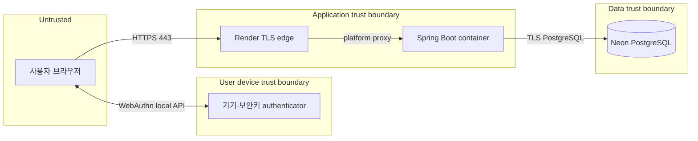

# T08 SKT ALeph 보안·네트워크 기준선

상태: 구현 기준선 · 2026-09-07

T07에서 사용한 원칙을 T08의 passkey 구조에 맞게 다시 적용한다. T07의 JWT·refresh
token·password 정책은 복사하지 않는다. T08의 인증 자격은 authenticator 안의 개인키이고,
서버는 공개키·일회용 challenge·서버 세션만 소유한다.

## 1. 신뢰 구역과 데이터 흐름



- 인터넷에서 직접 받는 값은 모두 불신한다: credential JSON, Origin, account ID,
  forwarded header, content type, 길이와 nickname.
- WebAuthn 개인키와 생체 정보는 authenticator 경계를 벗어나지 않는다.
- 앱은 `Forwarded`나 `X-Forwarded-*`로 expected origin을 만들지 않는다. 배포 환경에
  고정한 RP ID와 HTTPS origin만 WebAuthn 검증 기준으로 쓴다.
- 데이터 소유자는 URL이나 JSON의 account ID가 아니라 서버 세션 principal로만 정한다.

## 2. 위협과 통제

| 위협 | 서버 통제 | 검증 증거 |
| --- | --- | --- |
| HTTP 도청·변조 | 공개 운영은 HTTPS 한 origin, HTTP는 edge에서 HTTPS로 이동 | 배포 응답·TLS URL |
| 가짜 origin·프록시 헤더 | 설정의 exact origin/RP ID와 비교, forwarded host로 추론 금지 | 다른 Origin/RP ID 거절 |
| challenge 재생·경합 | 32-byte CSPRNG, DB 5분 만료, 첫 finish에서 원자적 소비 | 서로 다른 fingerprint·재생/동시 요청 거절 |
| 위조 credential·서명 | WebAuthn4J가 challenge, origin, RP ID hash, UP/UV, signature 검증 | 정상/변조 assertion 쌍 |
| 세션 탈취·고정 | 로그인 성공 때 session ID 교체, HttpOnly/Secure/SameSite=Lax, 30분 만료 | 전후 ID 가림 비교·로그아웃 재사용 401 |
| CSRF | 상태 변경은 JSON + exact Origin + session CSRF header | 정상/누락/불일치/교차 출처 전수 검사 |
| 다른 계정 자료 접근 | session account ID가 포함된 repository query, 타인 자료 404 | A→B, B→A와 전후 건수 |
| XSS·클릭재킹·기능 남용 | CSP, frame-ancestors none, nosniff, Permissions-Policy | 모든 응답 헤더 자동 검사 |
| 공개 등록·로그인 자동화 | IP HMAC 기반 DB rate limit, options 활성 건수 제한, 요청 크기 제한 | 임계 전후 429·재시작 후 유지 |
| 로그·증거 유출 | 중앙 redaction, raw challenge/session/signature/credential JSON/IP 금지 | 이벤트·증거·빌드·Git 패턴 감사 |
| DB 연결 도청·비밀 노출 | Neon TLS, secret은 Render 환경변수, 브라우저 번들·Git 배제 | 배포 설정 이름·비밀값 0건 감사 |
| 공급망·컨테이너 피해 | 버전 고정, 전체 테스트, multi-stage build, non-root runtime | dependency/build/image 검사 |

## 3. 네트워크 정책

### Ingress

- 외부 공개 포트는 Render edge의 HTTPS 443 하나다.
- `/`와 `/access`만 익명 사용자용 화면이다. 보호 URI는 애플리케이션에서도 다시
  세션을 검사하므로 edge 설정 오류가 곧 자료 공개로 이어지지 않는다.
- `/api/live`는 프로세스 생존만 반환하고 내부 버전·환경·DB 정보를 내보내지 않는다.
  DB readiness가 필요하면 일반 사용자에게 상세 오류를 내보내지 않는 별도 검사로 둔다.
- 관리·debug·H2 console·Actuator 상세 endpoint는 production에서 공개하지 않는다.

### Egress와 DB

- 정상 애플리케이션 egress는 Neon PostgreSQL TLS 연결뿐이다. Passkey 검증은 외부 인증
  서비스 호출 없이 서버 안에서 끝난다.
- Render Free에서 네트워크 egress allow-list를 강제할 수 없다면 이를 운영 한계로 적고,
  애플리케이션이 임의 URL을 받거나 호출하는 기능을 만들지 않는다.
- DB 계정은 애플리케이션 schema에 필요한 최소 권한만 사용한다. migration 권한 분리는
  호스팅 제약과 함께 배포 단계에서 결정하고 기록한다.

## 4. 세션·쿠키·응답

- 운영 쿠키: `JSESSIONID; Secure; HttpOnly; SameSite=Lax; Path=/`.
- URL rewriting을 끄고 세션 ID를 URL·응답 JSON·브라우저 저장소에 넣지 않는다.
- 인증·private·passkey ceremony 응답은 `Cache-Control: no-store`다.
- 기본 응답 헤더는 `Content-Security-Policy`, `Referrer-Policy: no-referrer`,
  `X-Content-Type-Options: nosniff`, `frame-ancestors 'none'`,
  `Cross-Origin-Opener-Policy: same-origin`, 최소 `Permissions-Policy`다.
- HSTS는 실제 HTTPS production profile에서만 보낸다. localhost HTTP 테스트에 HSTS를
  섞어 잘못된 증거를 만들지 않는다.

## 5. 보안 이벤트와 마스킹

기록 대상 예시:

```text
REGISTRATION_STARTED       REGISTRATION_SUCCEEDED    REGISTRATION_REJECTED
AUTHENTICATION_STARTED     AUTHENTICATION_SUCCEEDED  AUTHENTICATION_REJECTED
CEREMONY_REPLAY_REJECTED   ORIGIN_REJECTED           CSRF_REJECTED
PRIVATE_ACCESS_DENIED      CREDENTIAL_DELETED        RATE_LIMITED
LOGOUT
```

절대 기록하지 않는 값:

```text
raw challenge · credential JSON · authenticator data · assertion signature
session ID · Cookie/Set-Cookie 원문 · CSRF 원문 · DB URL/password · 원본 IP
```

IP 제한 식별자는 별도 `IP_HASH_SECRET`으로 HMAC한다. 마스킹은 이벤트와 제출 증거가 같은
중앙 함수를 통과하게 한다. “어디에도 없다”는 무한한 주장은 하지 않고, 검사한 응답·로그·
DB 이벤트·worktree·빌드·Git 이력의 범위를 함께 적는다.

## 6. 단계별 보안 gate

1. 모든 새 endpoint는 공개/보호와 허용 method를 먼저 표에 등록한다.
2. 상태 변경 endpoint는 정상보다 먼저 Origin·CSRF·content-type 거절 테스트를 만든다.
3. DB 모델은 FK/UNIQUE/CHECK와 계정 소유권 조건을 서비스 코드보다 먼저 고정한다.
4. 성공 테스트마다 동일 주소·동일 방식의 실패 또는 재생 테스트를 짝으로 둔다.
5. raw 보안값을 출력하지 않고 fingerprint 또는 `[redacted]`만 증거에 남긴다.
6. 각 slice 종료 때 테스트, 보안 헤더, secret pattern, 공개 source 누출 검사를 실행한다.

## 7. 현재 남은 위험

- 누구나 공개 등록을 시작할 수 있어 분산 IP를 이용한 계정 생성 남용은 완전히 막지 못한다.
- Render와 Neon 사이 연결은 TLS이지만 전용 사설망이라고 주장하지 않는다.
- 단일 인스턴스 메모리 세션은 재시작 때 사라지며, 다중 인스턴스 확장 전에는 공유 세션
  저장소가 없다.
- CSP가 있어도 같은 출처의 허용 스크립트가 변조되면 CSRF 방어를 우회할 수 있다.
- authenticator를 모두 잃으면 이메일·비밀번호·관리자 복구가 없어 계정을 복구할 수 없다.
- syncable passkey의 sign counter가 0이면 복제 탐지 신호가 제한된다.

이 항목은 최종 인증 구현 설명서의 “⑥ 아직 못 막은 것”에 실제 배포 결과와 함께 갱신한다.
